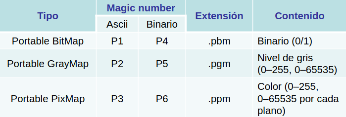

# Tema 1 introduccion

## Que es vision artificial?

La vision artificial es una disciplina que se encarga de la automatización de tareas que el ojo humano realiza de manera natural. Esta disciplina se encarga de la adquisición, procesamiento y análisis de imágenes digitales. En el cual se requiere de tecnicas de percepción, Conocimiento/Razonamiento y Acción.

La vision artificial estudia la interpretacion de escenas a partir de proyecciones 2D/3D mediante un sistema informático

### Terminos relacionados con la vision artificial
* **Tratamiento (o procesamiento) de imágenes**: Se refiere a la manipulación de imágenes digitales mediante un algoritmo.
* **Análisis de imágenes**: Se refiere a la realización de operaciones sobre una imagen para obtener información.
* **Visión por computador**: Trata de emular la visión humana mediante un sistema informático.
* **Visión industrial**: Se refiere a la aplicación de la visión artificial en la industria.

## Visión humana y artificial

### Visión humana
La visión humana es un proceso complejo que se lleva a cabo en el cerebro. El ojo humano es un órgano que capta la luz y la convierte en impulsos eléctricos que son enviados al cerebro. El cerebro se encarga de interpretar estos impulsos eléctricos y de darles un significado.
* Proyección imagen en retina
* Células sensibles: conos y bastones
* Imagen por nervio óptico.

### Visión artificial
La visión artificial es un proceso que se lleva a cabo en un sistema informático. Este sistema adquiere una imagen digital, la procesa y la analiza para obtener información. La visión artificial se basa en la adquisición de imágenes digitales, el procesamiento de estas imágenes y el análisis de las mismas.
* Proyección imagen en elemento fotosensible (CCD,…)
* Elementos fotosensibles:fotodiodos
* Imagen por señal de video

### Visión humana: Estrucutra del ojo
El ojo humano es un órgano complejo que se encarga de captar la luz y de convertirla en impulsos eléctricos que son enviados al cerebro. El ojo humano está formado por varias partes:
* **Fotoreceptores**: Son las células sensibles a la luz que se encuentran en la retina. Hay dos tipos de fotoreceptores: los conos (100 millones) y los bastones (7 millones).
  * **Conos**: Son los fotoreceptores responsables de la visión en color y de la visión diurna. Hay tres tipos de conos: los conos rojos, los conos verdes y los conos azules. En la Fóvea hay una alta concentración de conos.
  * **Bastones**: Son los fotoreceptores responsables de la visión en escala de grises y de la visión nocturna. Muy sensibles, incluso a un fotón.

### Sistema humano
* Mejor reconocimiento de objetos
* Mejor adaptación a situaciones imprevistas
* Utilización de conocimiento previo
* Mejor en tareas de alto nivel de proceso

### Sistema artificial
* Mejor midiendo magnitudes físicas
* Mejor para la realización de tareas rutinarias
* Mejor en tareas de bajo nivel de proceso

## Cámaras CCD

### Que es una cámara CCD?
Una cámara CCD es un dispositivo que se utiliza para captar imágenes digitales. Está formada por un sensor CCD (Charge-Coupled Device) que convierte la luz en una señal eléctrica. Esta señal eléctrica es convertida en una imagen digital que puede ser almacenada en un ordenador.

### Como se distribuyen los pixeles en una cámara CCD?
Los píxeles de una cámara CCD se distribuyen en forma de matriz. Cada píxel es un fotodiodo que convierte la luz en una señal eléctrica. La matriz de píxeles se organiza en filas y columnas. La resolución de una cámara CCD se mide en megapíxeles, que es el número de píxeles que tiene la cámara.

### Patrón de Bayer
El patrón de Bayer es un patrón de colores que se utiliza en las cámaras digitales para captar imágenes en color. El patrón de Bayer se compone de cuatro colores: rojo, verde, azul y verde. Cada píxel de la cámara CCD tiene un filtro de color que permite captar uno de estos colores. El patrón de Bayer se utiliza para captar imágenes en color de alta calidad.

### Tri-CCD
Un sistema Tri-CCD es un sistema que utiliza tres sensores CCD para captar imágenes en color. Cada sensor CCD está equipado con un filtro de color que permite captar uno de los tres colores primarios: rojo, verde y azul. El sistema Tri-CCD se utiliza en cámaras de alta calidad para captar imágenes en color con una alta fidelidad cromática.

Para dividir una imagen se usa un prisma que divide la luz en tres colores: rojo, verde y azul. Cada color es captado por un sensor CCD distinto.

## Cámaras matriciales y lineales

### Cámaras matriciales
Las cámaras matriciales son cámaras que utilizan un sensor CCD para captar imágenes en dos dimensiones. El sensor CCD está formado por una matriz de píxeles que se organizan en filas y columnas. Las cámaras matriciales se utilizan para captar imágenes en color y en blanco y negro.

### Cámaras lineales
Las cámaras lineales son capazes de ver el mundo a apartir de captar la imagen fila por fila con un sensor lineal. Para construir la imagen requieren de desplazar la cámara o el objeto a vizualisar, como por ejemplo un escaner de impresora.

## Representación de la imagen digital

* Función continua I(x, y).
* Matriz numérica discreta I(i, j).
* Píxel:
  * Valor intensidad luminosa.
  * Nivel de gris (imagen monocromática).

## Muestreo y cuantización
Las imagenes tienen una estructura de información discreta, que hacer que tengamos que usar tecnicas de doble proceso de discrtización para mostrar la imagen de forma nitida:
* Muestreo: determina la resolución de la imagen.
* Cuantización: número de niveles de gris.

## Tipos de imámegenes

### Imágenes monocromaticas
Son imágenes que contiene una unica escala de color, ya sea escala de grises, escala de rojos o cualquier otro color.

### Imágenes binarias
Son imagenes que unicamente tiene blanco o negro, representando 1 o 0.

### Imágenes en color (Multibanda)
Son aquellas imagenes que contienen mas de una escala monocromatica, como puede ser RGB o HSV.

### Imágenes de rango
Son imagenes que captan un rango de tonalidades parecidas entre ellas, cuando en una imagen existen pixeles al rededor de un pixel definido y son parecidos entre ellos, se transforman en una tonalidad media al rango de valor que se trabaja.

## Imágenes en color
* Imagen en color: Matriz tridimensional (con tres bandas o canales). El valor de cada píxel se representa mediante tres valores según un espacio de color.
* Transparencia: Se puede añadir una cuarta banda que indique un valor de transparencia:
  * 0: píxel transparente (solo se ve el fondo)
  * valor máximo: píxel opaco (solo se ve la imagen) 
  * valores intermedios: mezcla de imagen y fondo

## RGB
Trata de ajustarse a la sensibilidad del ojo humano. Es un modelo aditivo de color. Usado principalmente para visualizar imágenes en dispositivos electrónicos

## HSV
Es un modelo de color que representa los colores en términos de matiz, saturación y valor. Es un modelo de color cilíndrico que describe los colores en términos de tres componentes: matiz, saturación y valor.
* Matiz: Longitud de onda dominante en un color. Es un ángulo en una rueda cromática: Rojo – Amarillo – Verde – Cian – Azul – Magenta – Rojo
* Saturación: Intensidad del color. Es la pureza del color, 0 indica un color gris; el máximo valor, el color puro indicado por el tono
* Valor: Brillo del color. Es la cantidad de luz que contiene el color, 0 representa el negro. A medida que aumenta, los colores son más brillantes.
Se suele emplear en aplicaciones de edición del color. Sus  variaciones son más intuitivas que en el espacio RGB.

## CMY
* Es un espacio de color sustractivo.
* Cuando la luz blanca incide sobre un objeto, unas longitudes de onda se absorben y otras se reflejan. El color que nosotros percibimos es el de las longitudes de onda reflejadas.
* En el espacio de color CMY, las primitivas son las contrarias a las del espacio aditivo RGB. Se usa principalmente en impresoras (generalmente añadiendo K - Negro).

## Formatos de archivo
Formatos de archivos imagen. Hay innumerables:
* JPEG, GIF, PNG, PGM, PPM, BMP, TIFF, etc.

### Metodos de compresion de imagen

* Compresión Lossy: este tipo de compresion no le importa perder informacion a cambio de tener una imagen mas compacta
* Compresión Lossless: Este tipo de compresion evita la perdida de informacion cuando se comprime.

### Formatos portables sencillos: PBM, PGM, PPM
* Cabecera: Magic number, ancho, alto, valor máximo (no PBM)
* Datos en ASCII o binario sin ninguna compresión

### Formato GIF
Es un formato patentado que permite la inclusion de imagenes con animaciones.
* Paleta limitada a 256 colores
* Método de compresión patentado
* Animaciones y transparencias
* Alternativa: PNG

### Formato JPG
Este formato de imagenes es de tipo lossless y permite comprimir las imagenes controlando la calidad de la misma.
* Basado en la Transformada Discreta del Coseno
* Permite controlar el nivel de calidad (↑ calidad, ↓ compresión)

### Formato TIFF
Es un formato de imagenes que permite la compresion de imagenes sin perdida de informacion.
* Muy versátil
* Soporta distintos métodos de compresión
* Soporta imágenes a color, en escala de grises y binarias

