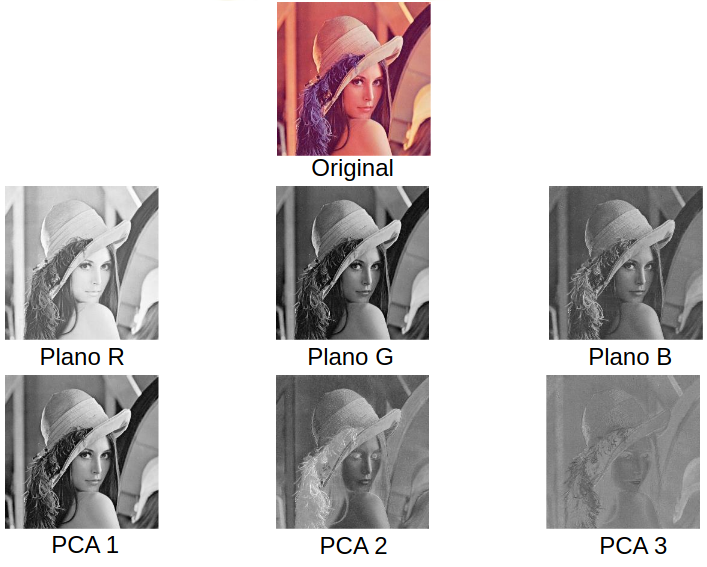

# Manipulación del contraste

## Histograma

Es el número de veces que repite una tonalidad de color en una image.
* Permite analizar la distribución de niveles de gris de la imagen
* Densidad de probabilidad de los niveles de gris


## Modificación del nivel de gris

Para nosotros trabajar con una imagen que tiende a tener una escala de colores muy claro o oscuro, normalmente hacemos una correccion de escala aclarando o oscureciendo la imagem, con el fin de mejorar ciertos aspecto de la imagen que a simple vista es dificil de ver.

* Objetivo: mejorar la visualización de la imagen
  * Aclarar / oscurecer una imagen
  * Llevar los niveles de gris a un rango más conveniente
* Funciones más usuales: (m: nivel original, p: nuevo nivel)
  * Invertir:  $ p = 255 - m $
  * Oscurecer: $ p = \frac{m^2}{255} $ <--> $ p = \frac{m^3}{255^2} $
  * Aclarar: $ p = \sqrt{255m} $  <-->  $ \sqrt[3]{255^2} $


## Transformación lineal a trozos

Es una tecnica para modificar el escalado de la imagen en ciertas secciones de la escala de grises, donde por metodos matematicos empleamos una transformacion linea para modificar ciertas partes de la escala de grises.

Su funcionamiento es el siguiente:

* Usamos una funcion a trozos como base, donde inicialmente cumple la ecuacion $ f(x) = x$
* Creamos otra funcion que devuelva el rango de escala nuevo a usar, ejemplo: $ f(x) = x + 3$
* Hacemos la condicion a cumplirse: Si $ 40 < x < 64$ entonce $ f(x) = x + 3$ sino $f(x) = x$

Al hacer este tipo de funcion, se genera un nuevo histograma con valores distribuidos mas uniformes, ya que al hacer la transformacion los valores anteriores ahora son diferentes y por lo tanto aumentaran el numero de pixeles que contengan el nuevo valor.


## Histograma acumulado

El histograma acumulado es una representación gráfica que muestra la suma acumulativa de los valores del histograma de una imagen. En otras palabras, en cada nivel de intensidad, el histograma acumulado muestra el número total de píxeles con una intensidad menor o igual a ese nivel. Esto es útil para diversas técnicas de procesamiento de imágenes, como la ecualización del histograma, que mejora el contraste de la imagen.

El histograma acumulado se calcula sumando los valores del histograma original de la imagen de manera acumulativa.


Resumiendo, es un histograma que va sumando el valor total de los pixeles menores o iguales al pixel a calcular, es decir, es un bucle que va sumando a una variable con el resultado en cada iteracion.

Ejemplo:

```python
histograma_acumulado = 0
for i in range(255):
    histograma_acumulado += calcular_histograma(i)
    print(histograma_acumulado)
```

## Ecualización del histograma

Objetivo: Repartir los niveles de gris existentes en el
rango de niveles de gris posibles.

Idea: Aproximar el histograma de la imagen ecualizada a un histograma plano.

Ecuaciones a usar para calcular la eculaización:

Ecuacion de la proporcion idonea para la ecualización:

$$ cant = \frac{NM}{G} $$

Ecuacion de la tranformacion de pixeles: A cada pixel se le calcula el nuevo valor de intensidad usando la función de transformación.

$$p = floor(\frac{H(m) - 1}{P}$$


### Ejemplo completo de calcular la ecualización

La ecuacion $\frac{N*M}{G}=P$ donde N y M la dimension de la imagen y G el tamaño de la imagen, P representa la proporcion de pixeles idoneo para la ecualización.

El algoritmo para poder calcular la ecualización de una imagen es el siguiente:

* Calcular el histograma de la imagen
* Calcular el histograma acumulado H(m)
* Calcular la P de la ecualización
* Se calcula la funcion de transformación
  * Usando la formula $p = floor(\frac{H(m) - 1}{P})$ donde floor es la función que redondea al entero inferior. (ejemplo: $floor(3.5) = 3$)
  * A cada pixel se le calcula el nuevo valor de intensidad usando la función de transformación. (ejemplo: para el pixel 2, se calcula $floor(\frac{(2-1)}{P})$)
  * Los $p$ resultados se redirigen a la posicion de la imagen a la que le corresponde su resultado.
    * Ejemplo: si el pixel 7,8 y 9 tienen el valor 3, se redirigen a la posición 3 de la imagen.
* Por ultimo se hace un sumatorio de los valores del histograma acumulado para cada pixeles que coincidan.
  * Ejemplo: si el pixel 7,8 y 9 tienen el valor 2, 0 y 2 respectivamente, se suman los valores y dan 4. Este valor se redirige a la posición 3 del histograma.

## Otras modificaiones del histograma

### Igualación de histogramas (Histogram matching)
* Los niveles de gris de la imagen se modifican para que el histograma acumulado de la imagen dada coincida con el histograma acumulado de imagen objetivo.
* A cada nivel m de la imagen original se le asigna el mayor valor p que cumple: $$ H_{original}(m) <= H_{objetivo}(p) $$


### Ecualización con incorporaciones aleatorias

Se trata de hacer un histograma con el numero de pixles iguales para cada tonalidad, pare se cumple que los valores de las nuevas modificaciones sean aleatorios cumpliendo lo siguiente:
* Insistir en obtener el histograma plano.
* Píxeles con un mismo nivel de gris en la imagen original pueden tener distintos valores en la imagen modificada.


## Ecualización adaptativa

Se trata de hacer una ecualización donde en todas las regiones de la imagen se encuentre el maximo contraste posible.

AHE: Adaptative Histogram Equalization
* Cada píxel se transforma según una ecualización
basada en una vecindad alrededor suyo.
* Problemas:
  * Amplifica el ruido en las zonas uniformes
  * Píxeles con un mismo nivel de gris en la imagen original pueden tener distintos valores.
  * Muy ineficiente → Se implementa por ventanas y con interpolación.


## CLAHE

Es un AHE pero con un umbral maximo de contraste posible.

CLAHE: Contrast Limited Adaptive Histogram Equalization
* Intenta solucionar la amplificación de ruido en zonas uniformes para cualquier versión de AHE.
* Limita el valor máximo permitido de los picos en el histograma. Los valores que superen un umbral, se reparten entre todos los niveles de gris.


## Resumen de las tranformaciones de los histogramas


## Transformación RGB → gris

Metodo por el cual tranformamos imagenes a color a escala de grises


## Análisis de Componentes Principales

Objetivo: Transformar los valores RGB a un nuevo sistema de coordenadas donde una de las bandas tenga el máximo contraste posible.


Inconvenientes: Las nuevas bandas no tienen un significado físico (no se corresponden con ningún color)

### Algoritmo

* Calcular la matriz de covarianza de la imagen

* Obtener los autovalores y autovectores de dicha matriz
* Transformar cada pixel x=(r, g, b)T utilizando la matriz A formada colocando cada autovector en una fila: y= Ax
* La “importancia” de cada banda viene dada por el valor del autovalor correspondiente. Si sólo se require una banda, se elige la del mayor autovalor.

