# Filtrado de la frecuencia

El objetivo de este tema es que queremos mejorar image

## Introduccion a la transformada de Fourier

La transformada de Fourier es una herramienta matemática que nos permite pasar de una señal en el dominio del tiempo a una señal en el dominio de la frecuencia. La transformada de Fourier de una señal $x(t)$ se define como:

$$X(f) = \int_{-\infty}^{\infty} x(t) e^{-j2\pi ft} dt$$

Donde $X(f)$ es la transformada de Fourier de $x(t)$ y $f$ es la frecuencia. La transformada de Fourier es una función compleja, por lo que se puede expresar en términos de su magnitud y fase:

$$X(f) = |X(f)| e^{j\angle X(f)}$$

Donde $|X(f)|$ es la magnitud de la transformada de Fourier y $\angle X(f)$ es la fase de la transformada de Fourier.

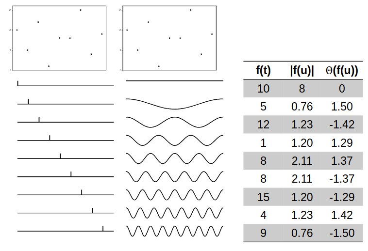

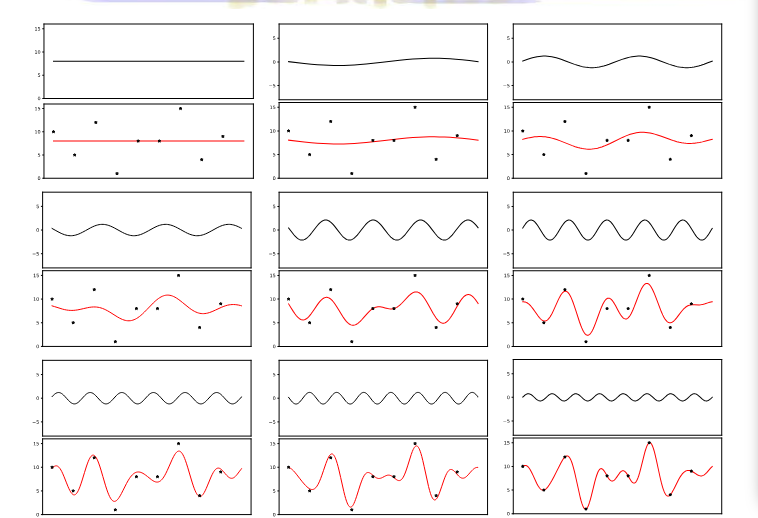
Se puede observar que entre mas frecuencias se sumen, la señal resultante se acercara a los valores de la señal original.

Cuando trabajamos con una imagen, esta es una señal discreta de dos dimensiones, por lo que la transformada de Fourier se define como:

$$X(u,v) = \sum_{m=0}^{M-1} \sum_{n=0}^{N-1} x(m,n) e^{-j2\pi (\frac{um}{M} + \frac{vn}{N})}$$

Donde $X(u,v)$ es la transformada de Fourier de la imagen $x(m,n)$, $u$ y $v$ son las frecuencias en las direcciones horizontal y vertical, respectivamente, y $M$ y $N$ son las dimensiones de la imagen.

En la siguiente imagen se ve como afecta cada una de las oscilaciones en una imagen, donde las zonas negras representan cuando la frecuencia es negativa y las zonas blancas representan cuando la frecuencia es positiva.
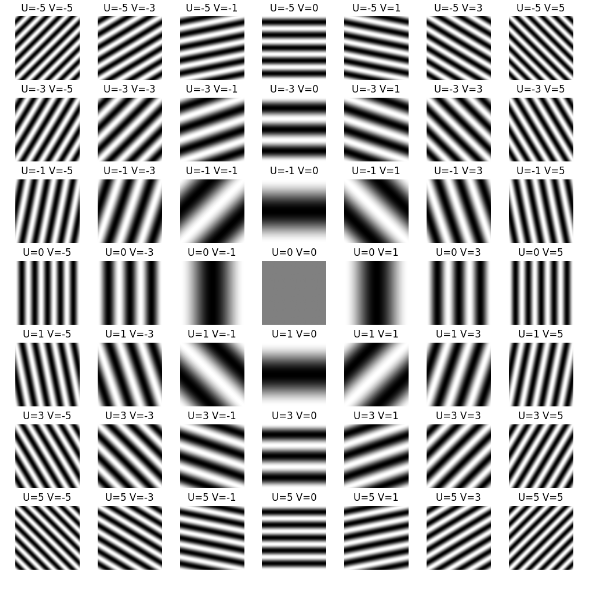
Entre mas franjas tiene la imagen, mas frecuencias contiene.

## Transformada discreta de Fourier

La transformada discreta de Fourier (DFT) es una versión discreta de la transformada de Fourier. La DFT de una señal $x(n)$ se define como:

$$X(k) = \sum_{n=0}^{N-1} x(n) e^{-j2\pi \frac{kn}{N}}$$

Donde $X(k)$ es la DFT de $x(n)$, $k$ es la frecuencia y $N$ es el número de muestras de la señal.

Cada componente de frecuencia es un número complejo.
* Parte real / parte imaginaria
$$ H(u,v) = R(u,v) + jI(u,v)$$
* Magnitud / fase
$$ |H(u,v)| = \sqrt{R^2(u,v) + I^2(u,v)}$$
$$ \theta(u,v) = tan^-1(\frac{I(u,v)}{R(u,v)}) $$

En la siguiente imagen se muestra como se ve la transformada de Fourier de una imagen.

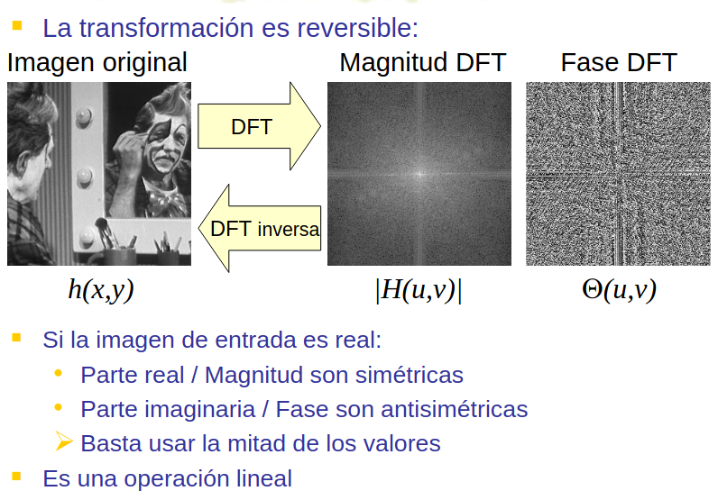

### Posible pregunta de examen
Cuando trabajamos con frecuencias, los colores uniformes y las zonas uniformes tienen bajas frecuencias, mientras que los bordes, las texturas y el ruido tienen altas frecuencias.

Por lo cual, nosotros nunca prodremos eliminar el ruido sin eliminar el ruido ya que, los bordes trabajan en bajas frecuencias

## Ruido blanco
Es un tipo de ruido que contiene todas las frecuencias en la misma cantidad. Es decir, todas las frecuencias tienen la misma amplitud. En el dominio de la frecuencia, el ruido blanco se ve como una distribución uniforme de energía en todas las frecuencias.

## Visualizacion de la transformada de Fourier discreta

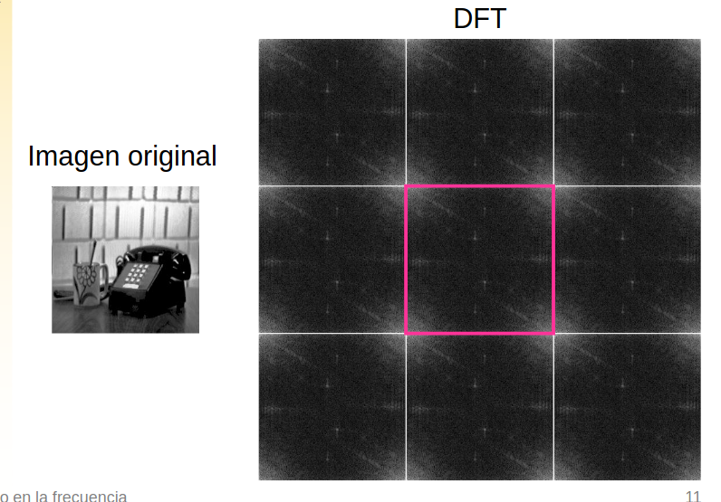

Cuando se hace la tranformada cada cuadrante es simetrico, por lo cual se puede hacer un truco para visualizar la transformada de Fourier de una imagen, que es hacer un shift de la imagen para que el origen de la imagen sea el centro de la imagen.

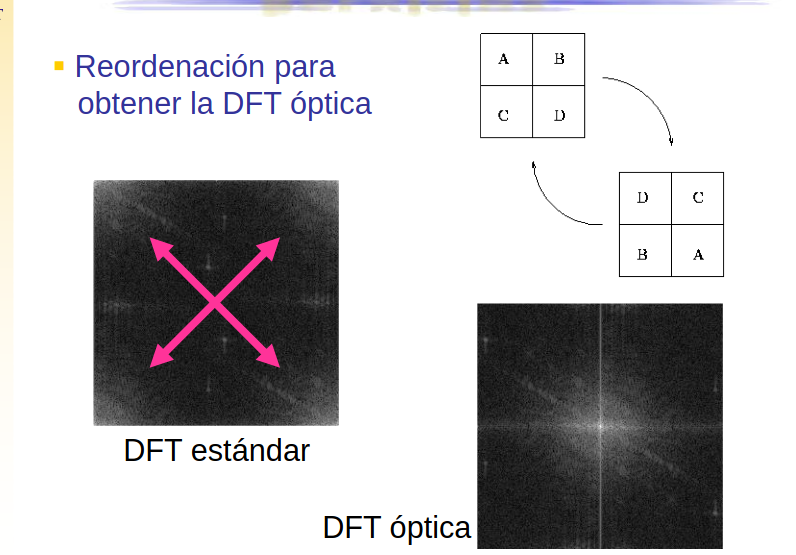
En esta imagen, cambiamos la visualizacion de los puntos de la tranformada para que el centro este el conjuto de puntos mas brillantes. 

A esta transformacion se le llama tranformacion optica, y se usa para visualizar la transformada de Fourier de una imagen. 

Pero cuando queremos hacer operaciones con la tranformada tiene que trabajarse con la visualizacion estandar.

### Pasos para visualizar la transformada de Fourier de una imagen

1. Reordenación (Desplazamiento)
2. Si es la magnitud:
    Transformar a escala logaritmica
3. Reescalar al rango visualizable [0.0 – 1.0] ó [0 – 255]
    

## DFT / FFT
La DFT es una operación costosa computacionalmente, por lo que se utiliza la FFT (Transformada rápida de Fourier) para calcular la DFT de una señal de forma más eficiente. 

La FFT es un algoritmo que reduce la complejidad computacional de la DFT de $O(N^2)$ a $O(N \log N)$. La FFT divide la DFT en subproblemas más pequeños y luego combina los resultados de estos subproblemas para obtener la DFT de la señal original.

La FFT solo es aplicable si N es una potencia de 2. (Zero padding)

### Zero padding
Zero padding es una técnica que consiste en agregar ceros a una señal para que su longitud sea una potencia de 2. Esto se hace para poder aplicar la FFT a la señal.

Ejemplo:
1. Señal original: [1, 2, 3, 4]
2. Señal con zero padding: [1, 2, 3, 4, 0, 0, 0, 0]
3. Longitud de la señal: 8 (potencia de 2)
4. Se aplica la FFT a la señal con zero padding: FFT([1, 2, 3, 4, 0, 0, 0, 0])
6. Se eliminan los ceros de la DFT: DFT([1, 2, 3, 4])
7. Se obtiene la DFT de la señal original: DFT([1, 2, 3, 4])

## Usos de la Transformada de Fourier
* Cálculo de rotaciones: La magnitud de la FT rota igual que la imagen
* Cálculo de desplazamientos: La magnitud de la FT no varía. La información se obtiene a partir de la fase
* Filtrado (Teorema de la convolución): La convolución en el espacio equivale a un producto en la frecuencia:
$$ h(x,y) = f(x,y) * g(x,y)\ \ \ \ \ \ \  f \rightarrow F \ \ \ \ \ \ \ H(u,v) = G(u,v) \cdot F(u,v)$$
$$g \overset{\text{FT}}{\rightarrow} G$$
$$h \overset{\text{FT}}{\rightarrow} H$$

### Calculo de rotaciones usando la transformada de Fourier
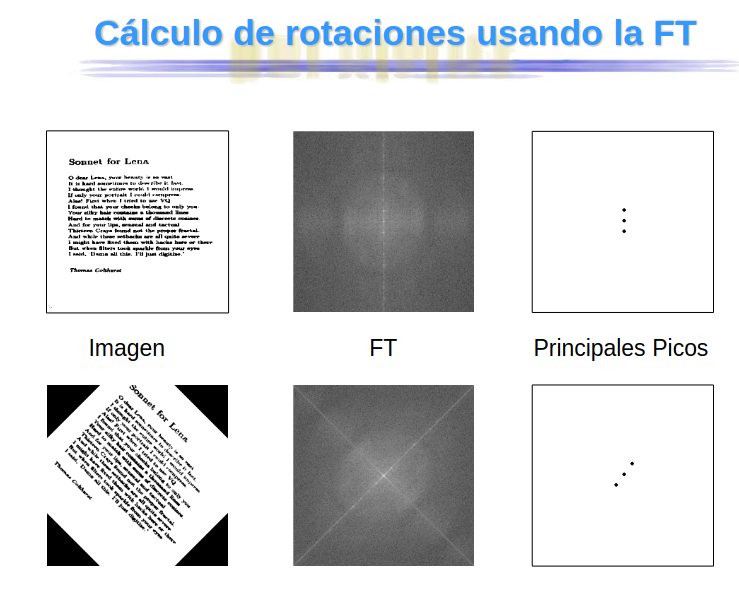

### Teorema de la convolución
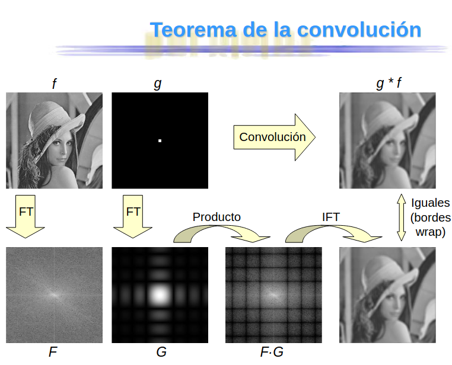
La convolución en el espacio equivale a un producto en la frecuencia. Es decir, si tenemos dos señales $f(x,y)$ y $g(x,y)$, la convolución de estas señales en el espacio es igual al producto de las transformadas de Fourier de estas señales en la frecuencia:

El teorema demuestra que independientemente del tamaño de la mascara, el tiempo de ejecucion es el mismo.
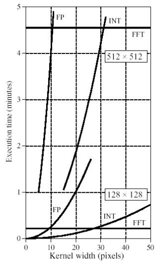

## Filtrado espacio / Filtrado frecuencia

### Filtro Media vs Filtro Gaussiano
El filtro media es un filtro que se utiliza para suavizar una imagen. Este filtro se aplica a una imagen para eliminar el ruido y las imperfecciones de la imagen. El filtro media calcula el promedio de los píxeles vecinos de un píxel y reemplaza el valor del píxel por el promedio de los píxeles vecinos. En otras palabras es un filtro de paso bajo.

El filtro gaussiano en el espacio tiene sentido ya que deja pasar las frecuencias bajas y 
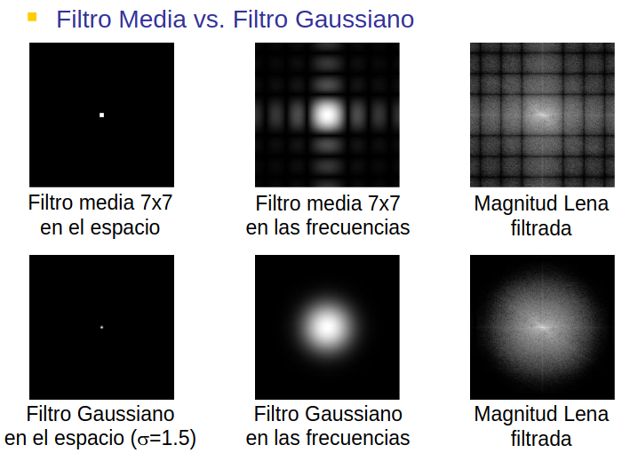

## Filtrado en la frecuencia
Si tenemos un ruido frecuencial, lo que hacemos es ver la imagen frecuencial y eliminar las frecuencias que no cumplen con el patron de frecuencia.
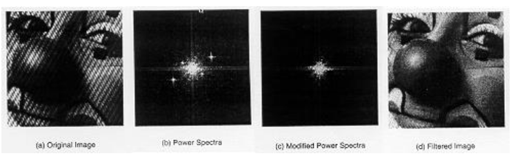

#### Filtro paso bajo
En este caso hacemos lo llamado fitrado de distancia que es que las frecuencias lejanas al centron de la imagen se atenuan y las frecuencias cercanas al centro se dejan pasar.
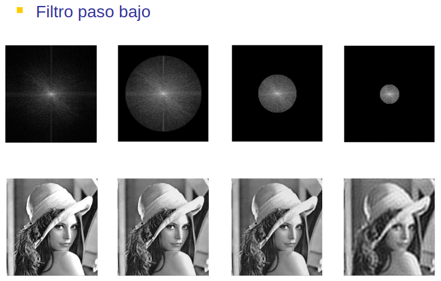

#### Filtro paso alto
En este caso hacemos lo llamado fitrado de distancia que es que las frecuencias cercanas al centron de la imagen se atenuan y las frecuencias lejanas al centro se dejan pasar.
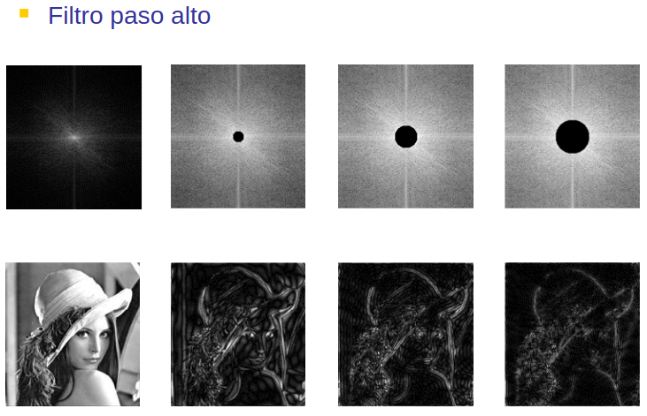
Un detalle de los filtros paso alto, es que me permite visualizar los bordes de una imagen.

## Filtros especificos
Filtros diseñados mediante técnicas de tratamiento de señal

Versiones discretas de filtros analógicos conocidos:
Butterworth, Chebyshev, Elípticos
### No se estudia
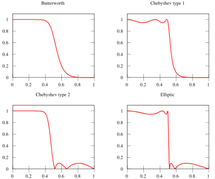

## Magnitud vs FAse
Cuando usamos la transformada de Fourier, podemos trabajar con la magnitud o con la fase de la transformada. La magnitud de la transformada de Fourier nos da información sobre la energía de las frecuencias en la imagen, mientras que la fase de la transformada de Fourier nos da información sobre la posición de las frecuencias en la imagen.

¿Que contiene mas informacion la magnitud o la fase?

La magnitud de la transformada de Fourier contiene más información que la fase. La magnitud de la transformada de Fourier nos da información sobre la energía de las frecuencias en la imagen, mientras que la fase de la transformada de Fourier nos da información sobre la posición de las frecuencias en la imagen.