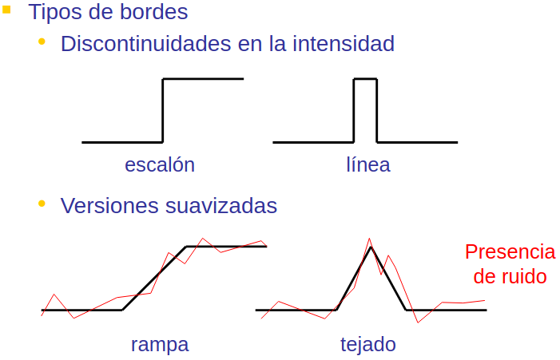
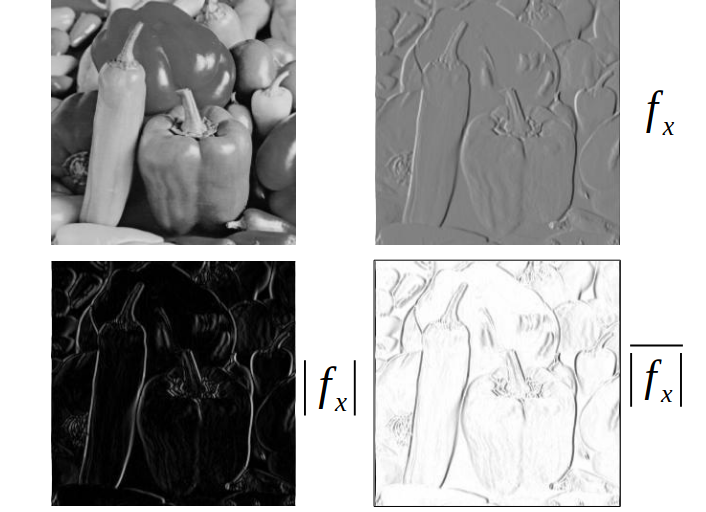
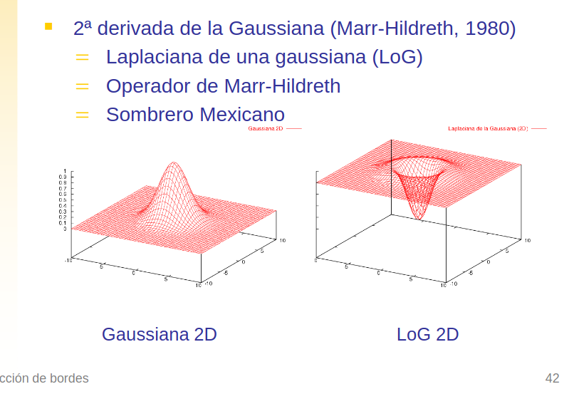
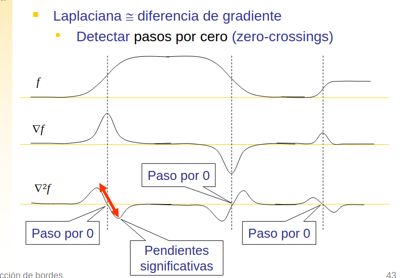

# Detección de bordes y esquinas

## Introducción: ¿Que es un borde?

Un borde es un cambio significativo en la intensidad. 

En una imagen en escala de grises, un borde es una región donde la intensidad cambia bruscamente. En una imagen a color, un borde es una región donde el color cambia bruscamente.

### Utilidad de los bordes

Los bordes son muy importantes en el procesamiento de imágenes, ya que contienen información sobre la forma y la textura de los objetos en la imagen.

Los bordes son utilizados en muchas aplicaciones de visión por computadora, como la detección de objetos, la segmentación de imágenes, el reconocimiento de patrones, etc.

Cuando detectamos los bordes a la imagen resultado se le llama mapa de bordes, y sus pixeles son 0 o 1, donde 0 es un pixel que no es borde y 1 es un pixel que es borde.

### Tipos de bordes

### Pasos en la deteccion

Detector de bordes = Algoritmo que obtiene un conjunto de bordes a partir de una imagen:
1. Filtrar para realzar cambios en intensidad
2. Decidir cuáles son bordes y cuáles no
3. Estimación con precisión subpixel (opcional)

1. Filtrar para resaltar cambios en intensidad
a. Suavizado
b. Realzado

2. Detección o localización (decidir si es borde o no)
   * Errores: bordes falsos, bordes perdidos.

## ¿Que es el gradiente?

El gradiente es un vector que indica la dirección y la magnitud del cambio más rápido en una función. En el caso de una imagen, el gradiente indica la dirección y la magnitud del cambio más rápido en la intensidad de los píxeles.

El gradiente se calcula de la siguiente manera:
$$\nabla f = \begin{bmatrix} \frac{\partial f}{\partial x} \\ \frac{\partial f}{\partial y} \end{bmatrix}$$

Siendo $\nabla f$ el gradiente de la imagen, $\frac{\partial f}{\partial x}$ la derivada parcial de la imagen en la dirección x y $\frac{\partial f}{\partial y}$ la derivada parcial de la imagen en la dirección y.

Si se calcula cada uno de los componentes del gradiente, se obtiene el gradiente de la imagen en cada punto.

## Magnitud y orientacion del gradiente

La magnitud del gradiente es la longitud del vector gradiente y se calcula de la siguiente manera:
$$\text{magnitud} = \sqrt{(\frac{\partial f}{\partial x})^2 + (\frac{\partial f}{\partial y})^2}$$

La orientación del gradiente es el ángulo que forma el vector gradiente con el eje x y se calcula de la siguiente manera:
$$\text{orientación} = \arctan(\frac{\frac{\partial f}{\partial y}}{\frac{\partial f}{\partial x}})$$

La magnitud y la orientación del gradiente se utilizan para detectar bordes en una imagen. La magnitud del gradiente indica la intensidad del cambio en la imagen, mientras que la orientación del gradiente indica la dirección del cambio en la imagen.

## Filtros de realzado
Los filtros de realzado son filtros que se utilizan para realzar los bordes en una imagen. Estos filtros se aplican a una imagen para resaltar los bordes y hacerlos más visibles.

Caracteristicas:
* Máscaras de convolución
* Coeficientes positivos y negativos
* Los coeficientes deben sumar 0
  * Ante una entrada uniforme no hay respuesta

## Filtros gradiente
Los filtros gradiente son filtros que se utilizan para calcular el gradiente de una imagen. Estos filtros se aplican a una imagen para calcular la magnitud y la orientación del gradiente en cada punto de la imagen.

El operaod

En el calculo de la gaussiana nosotros lo que hacemos es calcular la derivada de la gaussiana en x y en y, y luego aplicar la convolución de la imagen con la derivada de la gaussiana en x y en y.

Para los valores de la gaussiana se debe de cumplir que debe de sumar 1.

## Detectores basados en gradiente
Cuando se calcula el gradiente de una imagen, se puede utilizar la magnitud y la orientación del gradiente para detectar bordes en la imagen. Hay varios detectores de bordes basados en el gradiente que se utilizan para detectar bordes en una imagen.
* Magnitud del gradiente ~= Cantidad de cambio
* Cambios signif. ~= Picos signif. en la magnitud

Si se supera el umbral, se considera borde.

### Binarización de la magnitud del gradiente
La binarización de la magnitud del gradiente es un paso importante en la detección de bordes en una imagen. La binarización de la magnitud del gradiente consiste en convertir la magnitud del gradiente en una imagen binaria, donde los píxeles que superan un cierto umbral se consideran bordes y los píxeles que no superan el umbral no se consideran bordes.

## Detector de Bordes de Canny

El detector de bordes de Canny es un algoritmo avanzado para detectar bordes en imágenes, desarrollado por John F. Canny en 1986. Es considerado uno de los métodos más eficientes y precisos para la detección de bordes.

### Características principales

- **Detección óptima**: Minimiza la probabilidad de detectar falsos bordes y de perder bordes reales.
- **Buena localización**: Los bordes detectados están lo más cerca posible de los bordes reales.
- **Respuesta única**: Genera una sola respuesta por borde, evitando respuestas múltiples.

### Funcionamiento del algoritmo

El detector de bordes de Canny sigue cuatro pasos principales:

1. **Suavizado**: La imagen se suaviza mediante un filtro gaussiano para reducir el ruido.
2. **Cálculo del gradiente**: Se calcula la magnitud y dirección del gradiente en cada píxel.
3. **Supresión de no máximos**: Se adelgazan los bordes buscando los máximos locales en la dirección del gradiente.
4. **Umbralización con histéresis**: Se utilizan dos umbrales (alto y bajo) para clasificar los píxeles como:
   - Bordes fuertes (superior al umbral alto)
   - Bordes débiles (entre umbral alto y bajo)
   - No bordes (inferior al umbral bajo)

Los bordes débiles se incluyen en el resultado final solo si están conectados a bordes fuertes, lo que reduce el ruido y preserva bordes significativos.

### Ventajas

- Proporciona bordes bien definidos y precisos
- Es resistente al ruido
- Genera bordes de un píxel de ancho
- Preserva estructuras importantes y elimina detalles irrelevantes

Canny es ampliamente utilizado en aplicaciones de procesamiento de imágenes, visión por computadora y reconocimiento de patrones cuando se requiere una detección de bordes precisa.

## Detectores de bordes basados en la laplaciana

### ¿Qué es la laplaciana?
El operador Laplaciano es un operador diferencial que se utiliza para calcular la segunda derivada de una función. En el caso de una imagen, el operador Laplaciano se utiliza para calcular la segunda derivada de la intensidad de los píxeles.

Lo que buscamos cuando calculamos la laplaciana es encontrar los cambios de en cero.

La laplaciana se calcula de la siguiente manera:
$$\nabla^2 f(x,y) = \frac{\partial^2 f}{\partial x^2} + \frac{\partial^2 f}{\partial y^2}$$

## Filtros de la laplaciana
Los filtros de la laplaciana son filtros que se utilizan para calcular la laplaciana de una imagen. Estos filtros se aplican a una imagen para calcular la segunda derivada de la intensidad de los píxeles.

## Laplaciana + imagen original
La laplaciana se puede combinar con la imagen original para obtener una imagen que resalte los bordes en la imagen original. Esto se puede hacer sumando la laplaciana a la imagen original o restando la laplaciana de la imagen original.

## Filtro LoG (Laplaciana de la Gaussiana)
El filtro LoG (Laplaciana de la Gaussiana) es un filtro que se utiliza para calcular la laplaciana de una imagen suavizada con un filtro gaussiano. Este filtro se utiliza para detectar bordes en una imagen y se aplica a una imagen para resaltar los bordes y hacerlos más visibles.

El filtro LoG se calcula de la siguiente manera:
$$LoG(x,y) = \nabla^2 G(x,y) = \frac{\partial^2 G}{\partial x^2} + \frac{\partial^2 G}{\partial y^2}$$
$$\nabla^2G=(\frac{x^2+y^2-2\xi^2}{\xi^4}) e^{\frac{x^2+y^2}{2\xi^2}}$$

## Espacio Escala
El espacio escala es un espacio de imágenes que se utiliza para representar una imagen en diferentes escalas. En el espacio de escala, una imagen se representa en diferentes escalas para detectar bordes en diferentes tamaños.

En un filtro Gaussiano $\xi$ regula la cantidad de
suavizado
* menor →
  * Más sensibilidad al ruido / Más bordes falsos
  * Más precisión en la localización
* mayor →
  * Más bordes perdidos / Bordes encontrados son robustos
  * Menor precisión (deslocalización) / Bordes cercanos pueden llegar a mezclarse

Solucion:
* Filtrar con máscaras de distintos
* Analizar el comportamiento de los bordes a diferentes escalas de filtrado
  * mayor → bordes robustos, pero desplazados
  * menor → mejor localización

## Detección de esquinas
Las esquinas son puntos en una imagen donde se encuentran dos bordes. Las esquinas son muy importantes en el procesamiento de imágenes, ya que contienen información sobre la forma y la textura de los objetos en la imagen.

* Esquina = Intersección de 2 bordes rectos
    * Nivel semántico más alto
* Particularmente importantes para:
  * Orientar objetos
  * Dar medidas de sus dimensiones
* Detección de esquinas
  * Basada en bordes:
    Bordes → contornos → Segmentos rectos → Intersección de rectas
  * Basada en filtros específicos
  * Otros métodos

### Basados en derivadas de 2º orden
Consideran variaciones locales en la intensidad, hasta, al menos, el 2º orden.
En una esquina:
* Cambia significativamente la dirección del gradiente, y
* La magnitud del gradiente también es significativa.

## Detectores de esquinas
### Kitchen-Rosenfeld
El detector de esquinas de Kitchen-Rosenfeld es un algoritmo para detectar esquinas en una imagen. Este algoritmo se basa en el cálculo de la matriz de covarianza de los gradientes en cada punto de la imagen.

Cumple un criterio de deteccion:

### Harris-Stephens

### FAST
Esta basado en el extractor de caracteristicas AST (Accelerated Segment Test) que es un detector de esquinas rápido y eficiente. Este detector se basa en la idea de que una esquina es un punto en una imagen donde hay una transición brusca de intensidad en todas las direcciones.

Se considera un círculo de radio r centrado en c
* Si n o más puntos consecutivos son más brillantes que c por un umbral t (o menos), el punto se considera una característica
* FAST → r = 3, n >= 9
* El orden en el que se chequean los píxeles influye en la eficiencia del método

