# Contornos

Partimos en este tema de haber hecho un mapa de bordes, que nos da una imagen binaria, donde los píxeles que son bordes tienen un valor de 1 y el resto 0.

Tenemos el caso de tener un mapa de bordes de 2 rectangulos separados, donde existen falsos positivos, que son principalmente ruido, y falsos negativos, que son bordes que no ha detectado lo que genera un agujero en el contorno.

## Transformada de Hough

### Introduccion

La transformada de Hough es una técnica utilizada para detectar formas geométricas en imágenes, como líneas, círculos y elipses. Se basa en la idea de transformar los puntos en el espacio de la imagen a un espacio de parámetros, donde las formas geométricas se convierten en puntos.

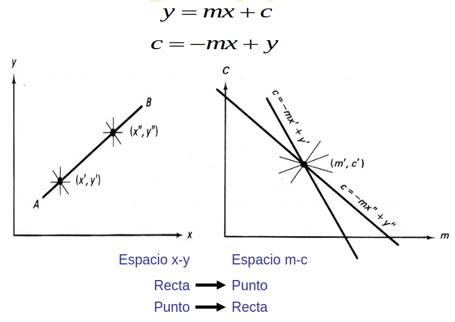

Dado la grafica anterior, se explica que para cada recta en el espacio x-y, se transforma a un punto en el espacio de parámetros (m, c). La recta se puede expresar como:
* Espacio x-y $$y = mx + c$$
* Espacio m-c: $$c = -mx +y$$

Donde m es la pendiente y c es la intersección con el eje y. En el espacio de parámetros, cada punto (x, y) en la imagen se transforma en una línea en el espacio de parámetros, que representa todas las posibles rectas que pasan por ese punto.

La transformada de Hough se utiliza para detectar líneas en imágenes, y se basa en la idea de que cada punto en la imagen puede ser parte de múltiples líneas. Al transformar los puntos en el espacio de parámetros, se pueden identificar las líneas que pasan por un número significativo de puntos, lo que indica la presencia de una línea en la imagen original.

Resumen: 
* Para cada punto en la imagen, se transforma a un espacio de parámetros.
* Cada punto en el espacio de parámetros representa una línea en la imagen.
* Se identifican las líneas que pasan por un número significativo de puntos.
* Las lineas que tengan un número significativo de puntos se consideran como bordes.

### Problemas de la transformada de Hough

Cuando usamos la transformada de Hough tenemos el problema que m es de valores infinitos, ya que la pendiente puede ser infinita. Para evitar esto, se utiliza la forma polar de la recta, que se expresa como:
$$\rho = x \cdot cos(\theta) + y \cdot sen(\theta)$$

Donde ρ es la distancia desde el origen al punto más cercano de la recta, y θ es el ángulo entre la recta y el eje x. En este espacio, cada punto (x, y) en la imagen se transforma en una curva en el espacio de parámetros (ρ, θ), que representa todas las posibles rectas que pasan por ese punto.

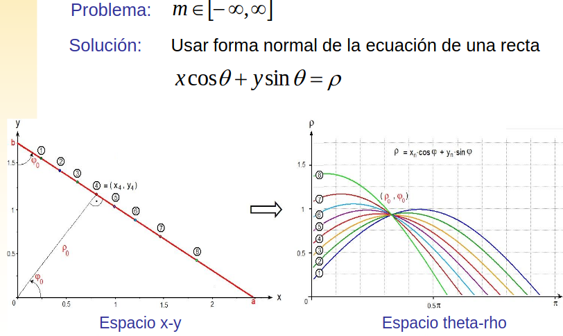

### Algoritmo de la transformada de Hough

1. Discretizar el espacio de parámetros (theta-rho), es decir, dividir el espacio de parámetros en una cuadrícula de celdas.
2. Considerar cada celda un acumulador inicializado a cero, es decir, cada celda representa un valor de (rho, theta).
3. Para cada edgel (x,y) incrementar los acumuladores que cumplan la ecuación anterior, es decir, para cada celda (rho, theta) que cumpla la ecuación de la recta, incrementar el acumulador correspondiente.
4. Los acumuladores con los máximos valores definen los parámetros del modelo, es decir, los valores de (rho, theta) que corresponden a las rectas detectadas en la imagen.

### Deteccion de otras formas geométricas

La transformada de Hough se puede extender para detectar otras formas geométricas, como círculos y elipses. Para detectar círculos, se utiliza la siguiente ecuación:
$$\rho = (x - a)^2 + (y - b)^2 - r^2$$
Donde (a, b) son las coordenadas del centro del círculo y r es el radio. En este caso, se utilizan tres parámetros (a, b, r) en lugar de dos (ρ, θ) para representar la forma del círculo.

Para detectar elipses, se utiliza la siguiente ecuación:
$$\rho = \frac{(x - a)^2}{a^2} + \frac{(y - b)^2}{b^2} - 1$$
Donde (a, b) son los semiejes de la elipse. En este caso, se utilizan cuatro parámetros (a, b, c, d) para representar la forma de la elipse.

Para detectar cuadrados, se utiliza la siguiente ecuación:
$$\rho = \sqrt{(x - a)^2 + (y - b)^2}$$
Donde (a, b) son las coordenadas de un vértice del cuadrado. En este caso, se utilizan cuatro parámetros (a, b, c, d) para representar la forma del cuadrado.

### Circulos: metodo naive
Para detectar círculos en una imagen, se puede utilizar un método naive que consiste en recorrer cada píxel de la imagen y comprobar si es el centro de un círculo. Para ello, se utiliza la siguiente ecuación:

$$\rho = (x - a)^2 + (y - b)^2 - r^2$$

Donde (a, b) son las coordenadas del centro del círculo y r es el radio. Para cada píxel (x, y) de la imagen, se comprueba si cumple la ecuación anterior para un rango de valores de r. Si se encuentra un valor de r que cumple la ecuación, se considera que el píxel (x, y) es el centro de un círculo.

Este método es ineficiente, ya que requiere recorrer cada píxel de la imagen y comprobar si es el centro de un círculo para un rango de valores de r. Sin embargo, es fácil de implementar y puede ser útil para imágenes pequeñas o con pocos círculos.

Ademas, debemos calcular los radios de los círculos, por lo que debemos recorrer todos los píxeles de la imagen y comprobar si son el centro de un círculo para un rango de valores de r.

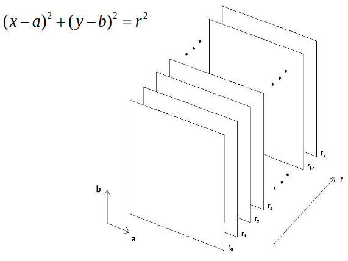

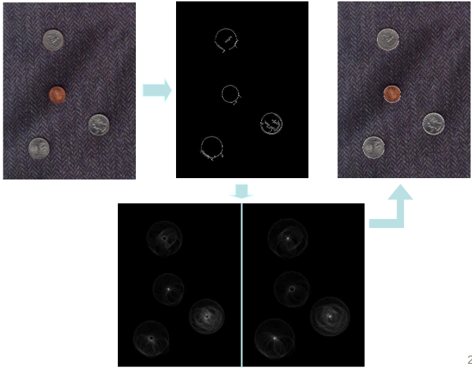

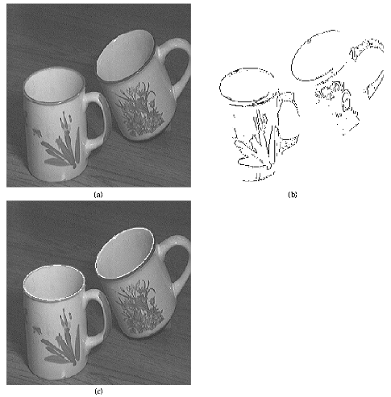

### Ventajas

* Robustez a ruido y oclusiones
* Robustez a presencia de otras formas
* Detección de múltiples instancias en una “pasada”

### Desventajas
* Coste computacional elevado
* Detección de falsos positivos
* Resolución del espacio acumulador
* Localización de picos

## Dimension del espacio acumulador

La dimensión del espacio acumulador depende de la forma geométrica que se desea detectar. Para líneas, el espacio acumulador es bidimensional (ρ, θ), ya que se utilizan dos parámetros para representar la recta. Para círculos, el espacio acumulador es tridimensional (a, b, r), ya que se utilizan tres parámetros para representar el círculo. Para elipses, el espacio acumulador es cuatridimensional (a, b, c, d), ya que se utilizan cuatro parámetros para representar la elipse.
Para cuadrados, el espacio acumulador es cuatridimensional (a, b, c, d), ya que se utilizan cuatro parámetros para representar el cuadrado. En general, la dimensión del espacio acumulador aumenta con el número de parámetros necesarios para representar la forma geométrica.

### ¿Cuál es el tamaño apropiado para el acumulador?

El tamaño del acumulador depende de la resolución de la imagen y del número de parámetros necesarios para representar la forma geométrica. En general, se recomienda utilizar un tamaño de acumulador que sea proporcional al tamaño de la imagen y al número de parámetros necesarios para representar la forma geométrica.

* Demasiado pequeño:
    * Baja precisión
    * Mayor tolerancia al ruido
* Demasiado grande
  * Muchos recursos computacionales

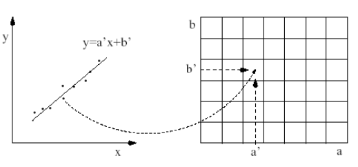

Cuando se tiene una resolucion del espacio acumulador es muy pequeño, como el caso de solo detectar rectas de 0º, 45º y 90º, se puede controlar bien el ruido, ya que se consideraran como parte de una de esas rectas cercana, o se ignoran.

Sin embargo si tienes una resolucion muy grande, el ruido se considera como una recta, ya que no se puede distinguir entre el ruido y la recta. Por lo que es importante encontrar un equilibrio entre la resolucion del espacio acumulador y el ruido.

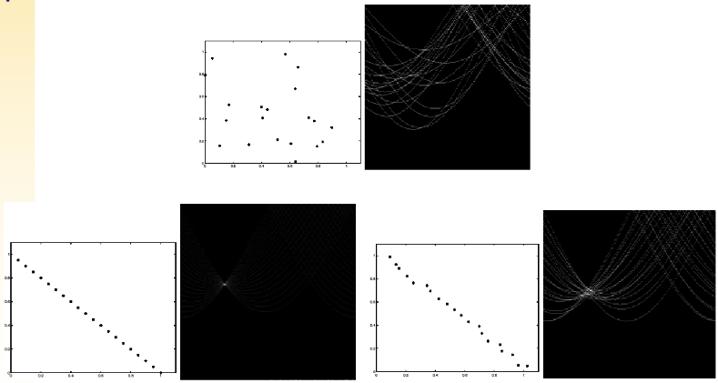

## Deteccion de picos
La detección de picos en el espacio acumulador es un paso importante en la transformada de Hough, ya que permite identificar las formas geométricas presentes en la imagen. Para detectar picos, se pueden utilizar diferentes técnicas, como la detección de máximos locales o la detección de bordes.

* Suavizar espacio acumulador antes de la búsqueda
* Técnicas de agrupamiento (clustering)
* “Eliminar” pico detectado tras cada iteración
* ¿Cuántos picos buscar? ¿Cuáles son “verdaderos”?
  * Umbral de votos
  * Conocimiento a priori
  * Restricciones del problema: 

## Deteccion de segmentos de recta

* Dos problemas tras la detección:
  * Cada pico representa una recta, no un segmento
  * Parámetros encontrados según la resolución del
  acumulador
* Estrategias:
  * Para cada celda, guardar edgels, no sólo votos
  * “Rastrear” la imagen cerca de la recta

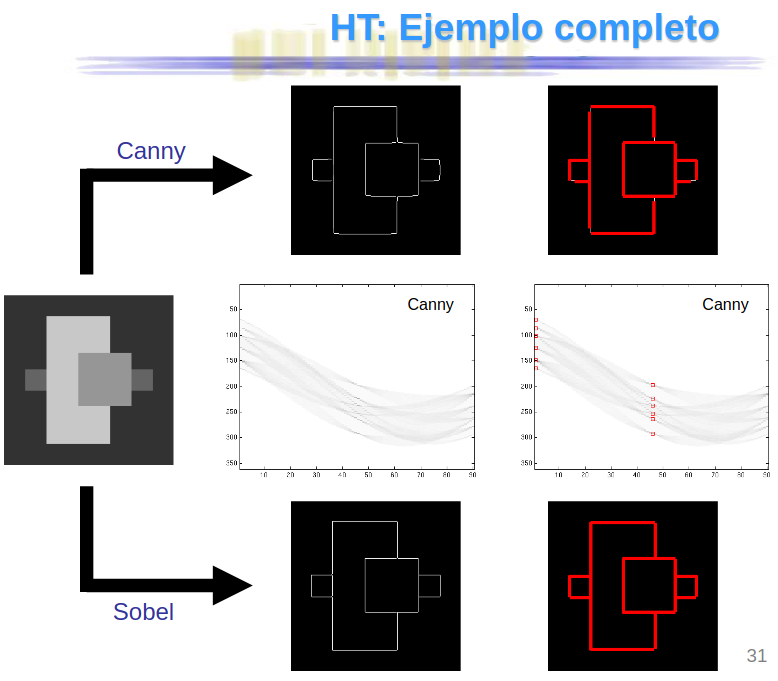

## Transformada de Hough probabilística y Progresiva

La transformada de Hough probabilística es una variante de la transformada de Hough que se utiliza para detectar formas geométricas en imágenes de manera más eficiente. En lugar de considerar todos los píxeles de la imagen, se selecciona un subconjunto aleatorio de píxeles y se aplica la transformada de Hough solo a esos píxeles. Esto reduce el tiempo de cálculo y mejora la eficiencia del algoritmo.

### Algoritmo de la transformada de Hough probabilística
1. Si el mapa de bordes está vacío, terminar
2. Elegir aleatoriamente un píxel del mapa y actualizar el espacio
acumulador con sus votos
3. Eliminar el píxel del mapa de bordes
4. Comprobar si el mayor valor que ha actualizado este píxel en el
espacio acumulador supera un umbral N. Si no, volver a 1
5. Mirar cerca de la recta definida por los parámetros de dicho valor
para encontrar el segmento continuo más largo posible o con
huecos que no superen un umbral
6. Eliminar los píxeles en el segmento del mapa de bordes
7. Eliminar del espacio acumulador los votos de todos los píxeles del
segmento que hubiesen votado previamente
8. Si el segmento supera una longitud mínima, añadirlo a la lista de
salida
9. Volver a 1

En resumen la transformada de Hough probabilística es una técnica eficiente para detectar formas geométricas en imágenes, que utiliza un subconjunto aleatorio de píxeles y un algoritmo iterativo para mejorar la eficiencia del cálculo. Esta técnica es especialmente útil en aplicaciones donde se requiere una detección rápida y precisa de formas geométricas en imágenes grandes o complejas.

## Transformada de Radon
La transformada de Radon es una técnica utilizada en procesos TAG (resonancias magneticas). Se basa en la idea de que cualquier forma geométrica puede ser representada como una suma de proyecciones a lo largo de diferentes ángulos.

* Relacionada con la Transformada de Hough
* No limitada a imágenes binarias
* Invertible
* Algoritmo
  * Calcular la integral sobre varias líneas paralelas (haz de rayos) proyectadas sobre la imagen desde una dirección dada
  * Repetir para varias posiciones rotando el haz de rayos desde el centro de la imagen

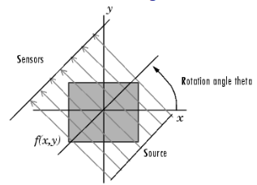

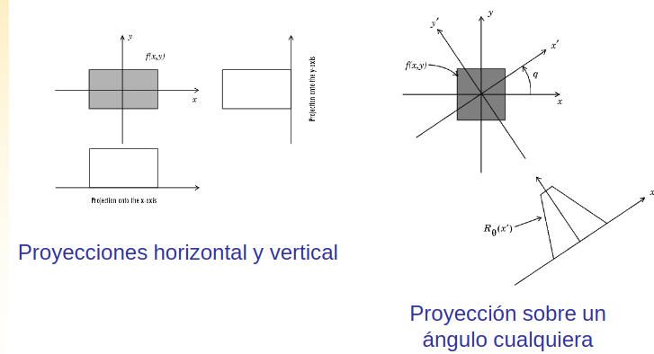

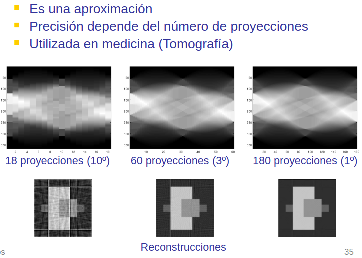

### Detección de líneas
Se basa en la idea de que cada línea en la imagen puede ser representada como una proyección a lo largo de diferentes ángulos. Al calcular la integral sobre varias líneas paralelas proyectadas sobre la imagen desde una dirección dada, se pueden identificar las líneas presentes en la imagen.

Al hacer 2 proyecciones la recta que corta a 2 proyecciones paralelas los puntos de intersección son los que definen la recta. Por lo que al hacer 2 proyecciones se puede detectar la recta.

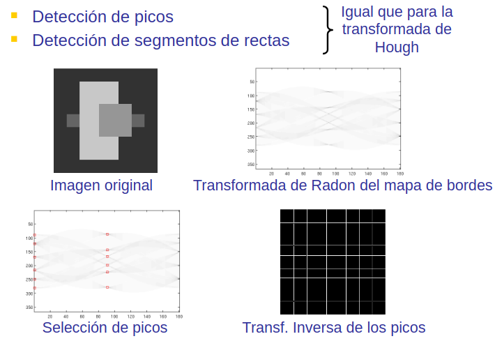